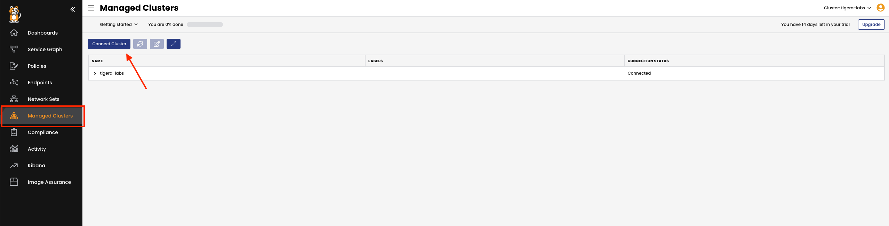
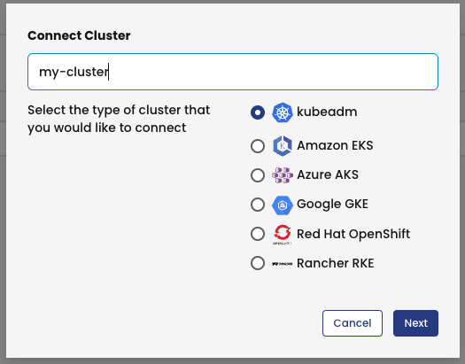
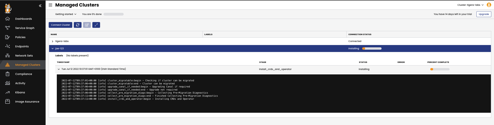

Signup and log into your Calico Cloud account.
Note: Use same email address from instruqt signup for Calicocloud signup
===============

Use the Calico Cloud tab to get your environment :


Once you activated your Calico Cloud account with your email, login to Calico Cloud using the same tab

Connecting your demo application with Calico Cloud
===============
Click the "Managed Cluster" in your left side of browser, then click on "connect cluster"



Enter your cluster name, choose kubeadm and click next



Copy the installation script and use the terminal tab in Instruqt to run it in your cluster


 Validate what we have done
==============

**Installation process will take around 5 minutes**

Use the terminal to check the Calico Cloud installation status:

```
kubectl get installer default --namespace calico-cloud -o jsonpath --template '{.status}{"\n"}'
```

once installtion is complete the status will change from **installing** to **done**

Check the installation status from the `managed clusters` page in Calico Cloud




Make sure that state is **done** before you move to the next challange

 Configure log flush intervals
==============
Configure log flush intervals in the cluster, we will use 10s instead of default value 300s for lab testing only.

```
kubectl patch felixconfiguration.p default -p '{"spec":{"flowLogsFlushInterval":"10s"}}'
kubectl patch felixconfiguration.p default -p '{"spec":{"dnsLogsFlushInterval":"10s"}}'
kubectl patch felixconfiguration.p default -p '{"spec":{"flowLogsFileAggregationKindForAllowed":1}}'
```

🏁 Finish
=========
To complete this challenge, press **NEXT**.
