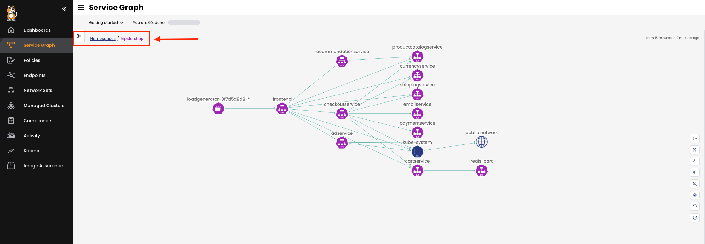

Welcome to Tigera's self-paced workshops. As a part of this workshop, we will provide you with a Calico Cloud trial account! This account will automatically terminate after 24 hours.

Run `invite` in the terminal on your left and when prompted enter your email address. You will receive an invitation from Calico Cloud environment. Accept the invitation in the email. As soon as you sign in Calico Cloud, we are setting up your demo application environment

**Installation process will take around 10 minutes**

Monitor the installation
==============

Use the terminal to check the Calico Cloud installation status:

```
kubectl get installer default --namespace calico-cloud -o jsonpath --template '{.status}{"\n"}'
```

once installtion is complete the status will change from **installing** to **done**

Check Hipstershop in Calico Cloud
==============
In this cluster we built a web-based e-commerce app where users can browse items, add them to the cart, and purchase them. This application called "Hipstershop"

First select the `default` cluster from the clusters menu in the top right corner.

<image>

Go to Service Graph in Calico Cloud and ensure that hipstershop application is running.
To view resources in the "hipstershop" namespace click on the `Service Graph` icon on the left menu.
Click on `Default` view for a top level view of the cluster resources:


Double click on the `Hipstershop` Namespace as highlighted to bring only resources in the "hipstershop" namespace in view along with other resources communicating into or out of the "hipstershop" Namespace.




Continue
==============
Once the installtion is **done** , click **NEXT**.
