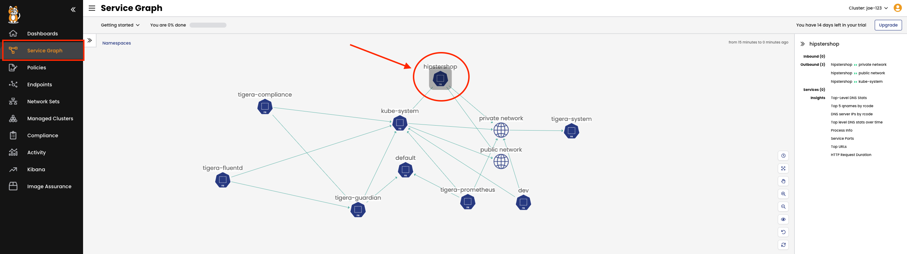

🚀 Let's build the Hipstershop application
==============

First, create a namespace called 'hipstershop' for the demo application:

```
kubectl create namespace hipstershop
```

Next we will deploy the Online Boutique (Hipstershop) application to the namespace.

```
kubectl apply -n hipstershop -f https://raw.githubusercontent.com/GoogleCloudPlatform/microservices-demo/main/release/kubernetes-manifests.yaml
```

Verify pods are running

```
kubectl get pods -n hipstershop
```

Output should be similar to the following:

```
root@controlplane:~# kubectl get pods -n hipstershop
NAME                                     READY   STATUS    RESTARTS   AGE
adservice-6f498fc6c6-lg7hm               1/1     Running   0          2m34s
cartservice-bc9b949b-k7v8j               1/1     Running   0          2m34s
checkoutservice-598d5b586d-h984z         1/1     Running   0          2m35s
currencyservice-6ddbdd4956-x5v5f         1/1     Running   0          2m34s
emailservice-68fc78478-2btn4             1/1     Running   0          2m35s
frontend-5bd77dd84b-n4xwv                1/1     Running   0          2m35s
loadgenerator-8f7d5d8d8-wxnvj            1/1     Running   0          2m34s
paymentservice-584567958d-t59kr          1/1     Running   0          2m34s
productcatalogservice-75f4877bf4-9mqld   1/1     Running   0          2m34s
recommendationservice-646c88579b-wp7gk   1/1     Running   0          2m35s
redis-cart-5b569cd47-xfj25               1/1     Running   0          2m34s
shippingservice-79849ddf8-85msj          1/1     Running   0          2m34s
```

Creating MultiTool container for testing
==============

The Network-MultiTool pod will be used in two namespaces to test the created security policies.

First, deploy the MultiTool into the default namespace:

```bash
kubectl run multitool --image=wbitt/network-multitool
```

Next, deploy a copy of the Mutlitool into the hipstershop namespace:

```bash
kubectl run multitool -n hipstershop --image=wbitt/network-multitool
```

Verify that both pods are up and running:

```bash
kubectl get pods -A | grep multitool
```

Both pods should be Running:

```bash
default                      multitool                                        1/1     Running            0              12s
hipstershop                  multitool                                        1/1     Running            0              31m
```

✅ Check Hipstershop in Calico Cloud
==============

Go to Service Graph in Calico Cloud and ensure that hipstershop application is running.
To view resources in the "hipstershop" namespace click on the `Service Graph` icon on the left menu.
Click on `Default` view for a top level view of the cluster resources:



Double click on the `Hipstershop` Namespace as highlighted to bring only resources in the "hipstershop" namespace in view along with other resources communicating into or out of the "hipstershop" Namespace.


🏁 Finish
=========

To complete this challenge, press **Check**.
