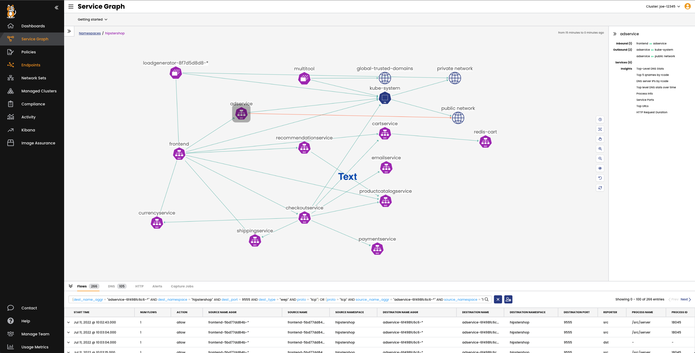

Dynamic Service and Threat Graph
===============

Dynamic Service and Threat Graph is a live visualization of pod and service communications for all applications within the cluster. It also provides customized views to show relationships between namespaces, services, and deployments.

- Explore the `hipstershop` resource in the Dynamic Service and Threat Graph.

- Click on the **Service Graph** icon on the left menu, which will display a top-level view of the cluster resources.
- Double-click on the `Hipstershop` namespace as highlighted to bring only resources in the `hipstershop` namespace in view, along with other resources communicating into or out of the `hipstershop` namespace.
- Expand the top right panel **<<** to get a detailed view of the service-to-service communications for the namespace.
- Go to the panel at the bottom (below the graph) to get the flow log data, which is already correlated and will help you troubleshoot connectivity and performance issues faster. When you select a node or edge in the graph, logs are filtered for the node or service.
- Right-click any resource to **hide** or **de-emphasize**, then **save** the view from the panel on the left. Click on  **>>** to expand the panel.
- Create **layers** that allows you to create meaningful groupings of resources, so you can easily hide and show them on the graph. For example, you can group resources for different platform infrastructure types in your cluster like networking, storage, and logging.

Flow Visualization
===============

Flow Visualizer lets you quickly drill down and pinpoint which policies are allowing and denying traffic between their services.

- To use the Flow Visualization, click on the **Service Graph** icon on the left menu then select **Flow Visualization**.

Kibana and Flow Logs
===============

Another helpful visualization tool for visualizing and troubleshooting compliance violations is the fully-integrated deployment of Elasticsearch, which includes built-in, custom dashboards.

- Click on the **Kibana** icon on the left menu.

- For example, you can use filters to drill into flow log data for specific namespaces and pods. You can also use it to view details and metadata for a single flow log entry.

💡 Exercise:

1. Log in to Kibana
2. Select DNS Dashboards
3. Filter DNS traffic from multitool pod
4. Set time window for the last 2 hours.
5. Export **DNS Top 10 external domains**

Click for Hint

  <pre>Add filter `client_name_aggr` is `multitool`</pre>

🏁 Finish
=========

If you've viewed the reports, click **Next** to continue to the next challenge.
