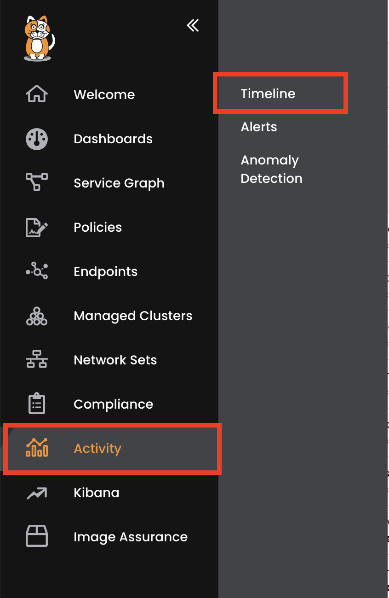
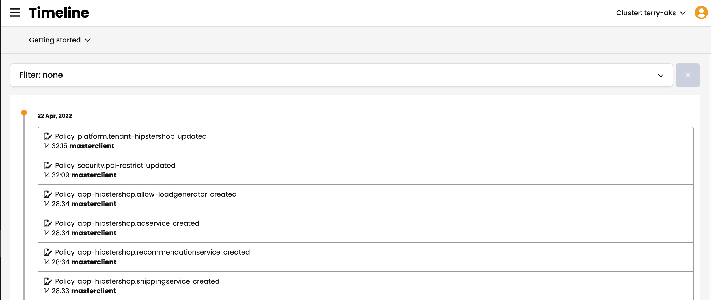
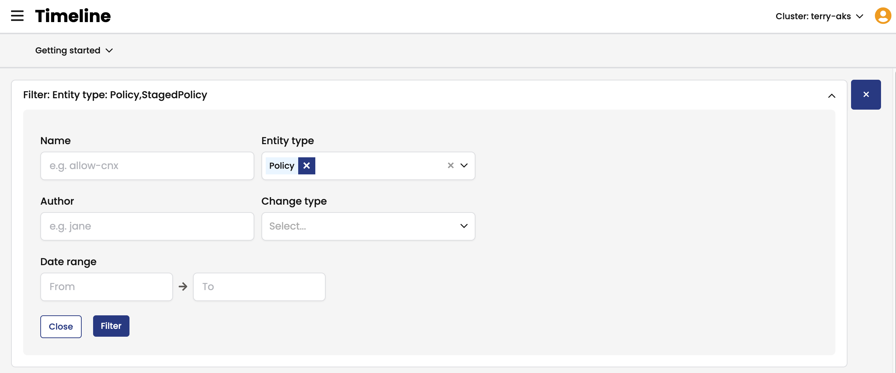
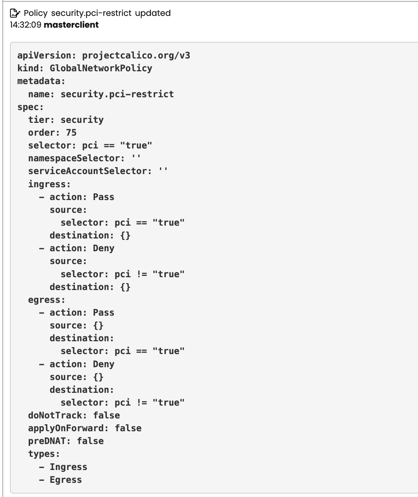
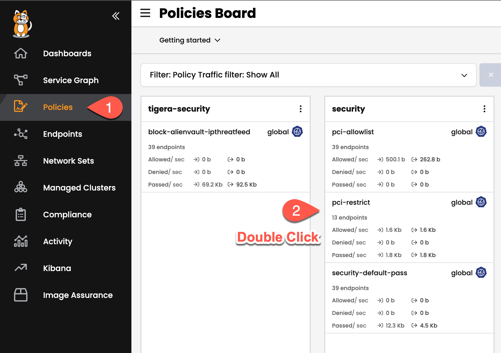
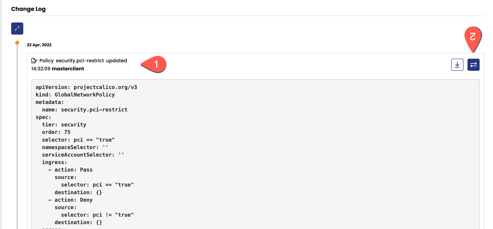
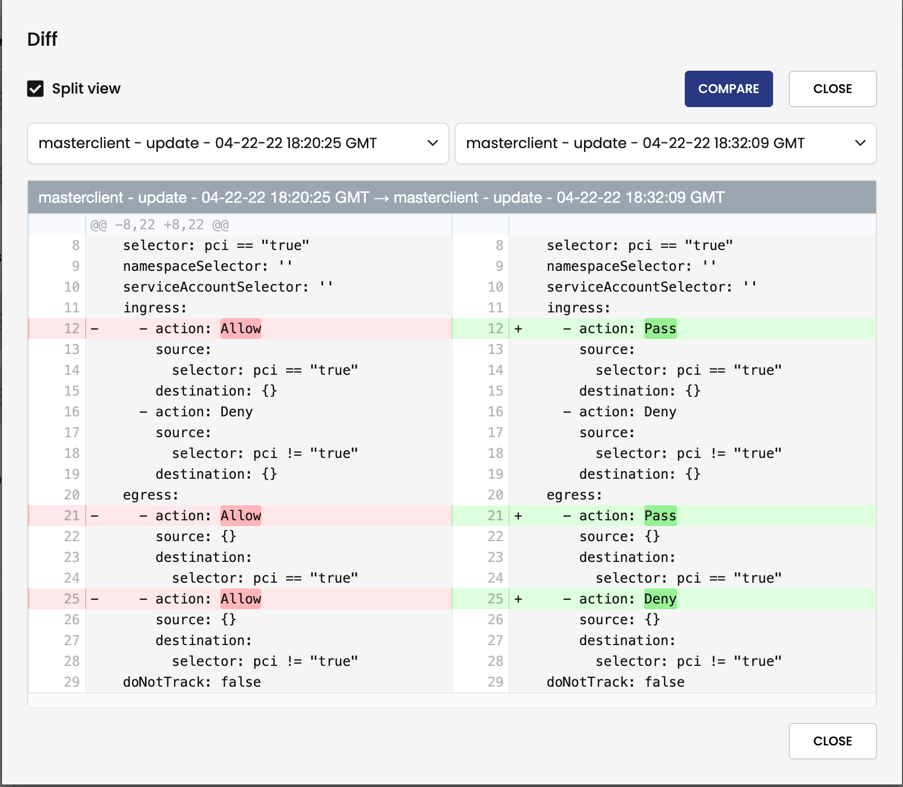
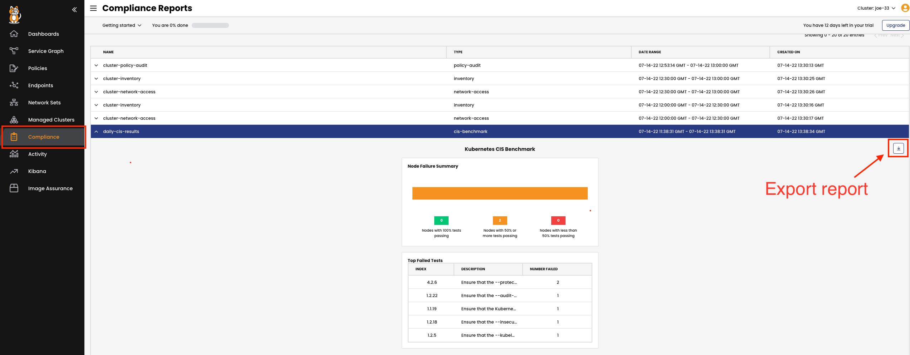

Audit logs
===============

Calico Cloud audit logs provide security, platform, and DevOps teams and auditors historical data of all changes to the resources over time.

Calico audit logs are enabled by default for the following resources:

- Global networkpolicies
- Network policies
- Staged global networkpolicies
- Staged networkpolicies
- Staged Kubernetes network policies
- Global network sets
- Network sets
- Tiers
- Host endpoints

Audit timeline
===============

Audit logs are accessible through Calico Cloud directly with the Timeline feature. To view these logs:

1. Open the **Timeline** page from the left navigation menu.



2. Either browse through the list of Audit Events or search using the filter at the top of the page.

- Audit Timeline


- Audit Filter


3. Audit Events contain the affected policy, the user who made the change and the manifest of the updated policy.


Policy Audit inside of policy
===============

Within each policy, there is a Change Log that allows you to see the audit entries for the specific policy you are currently viewing.

To access this information,

1. Open a Policy from from the Policies page and scroll down to the Change Log section.


2. Click on the **diff** button on an Audit Event to expand the details of that event.


3. To view changes in detail, click the **split view** checkbox in the top-right to bring up a side-by-side comparison of the two versions.


Archive logs
===============

Logs can be exported to an external SIEM, such as Splunk, syslog, or Amazon S3. For further information, see archive logs section in [Calico documentaion.](https://docs.tigera.io/visibility/elastic/archive-storage)

Compliance reports
===============

Using the **Compliance Reports** tab of Calico Cloud, you can create a number of reports to satisfy various PCI DSS, SOC 2, GDPR, and other internal organization compliance reporting requirements.
Calico Cloud supports the following built-in report types:

- Inventory
- Network Access
- Policy-Audit
- CIS Benchmark

We have already scheduled some reports to run daily.

Check `GlobalReports` in your environment

```bash
kubectl get globalreports
```

For the purpose of this workshop, we will run these reports manually using the following script:

```bash
./run-reports.sh
```

To view the generated reports in Calico Cloud, click on **Compliance** from the left menu. You also export these reports.



🏁 Finish
=========

Click **Next** to continue to the next challenge.
