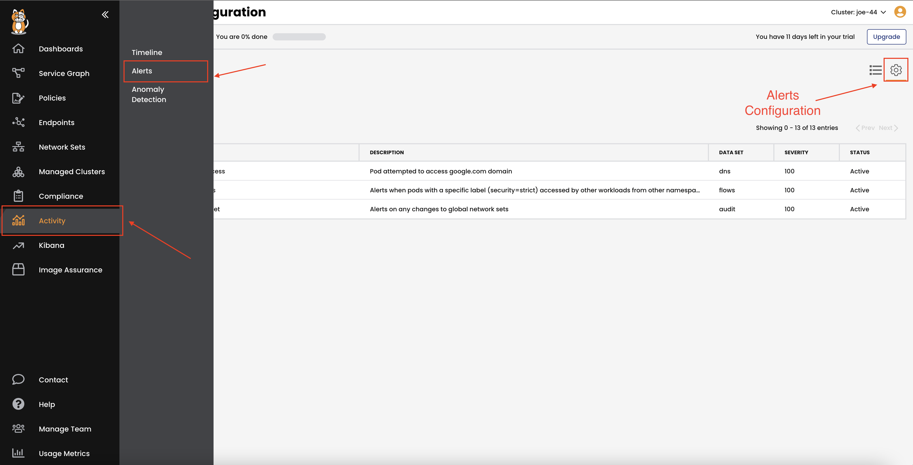
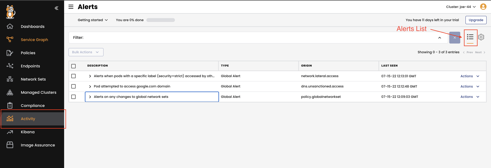

Alerts
===============

Calico supports global alerts to notify security and operations teams about unsanctioned or suspicious activity.

Alerts can be configured either through the CLI or through Calico Cloud. In this section, we will configure 3 different alerts:

- Alerts on configuration change
- Alerts on restricted DNS access
- Alerts on unsanctioned lateral movement

Configuration Change Alert
===============
- Generates an alert on any changes to global network sets.

```bash
kubectl apply -f -<<\EOF
apiVersion: projectcalico.org/v3
kind: GlobalAlert
metadata:
  name: policy.globalnetworkset
spec:
  description: "Alerts on any changes to global network sets"
  summary: "[audit] [privileged access] change detected for ${objectRef.resource} ${objectRef.name}"
  severity: 100
  period: 1m
  lookback: 1m
  dataSet: audit
  # alert is triggered if CRUD operation executed against any globalnetworkset
  query: (verb=create OR verb=update OR verb=delete OR verb=patch) AND "objectRef.resource"=globalnetworksets
  aggregateBy: [objectRef.resource, objectRef.name]
  metric: count
  condition: gt
  threshold: 0
EOF
```

- To trigger this alert, create a new `Networkset` or edit any of the existing ones.

```bash
kubectl apply -f -<<\EOF
kind: GlobalNetworkSet
apiVersion: projectcalico.org/v3
metadata:
  name: empty-networkset
  labels:
    external-endpoints: global-trusted
spec:
  nets: []
  allowedEgressDomains:
EOF
```


Restricted DNS Access Alert
===============
- Generates an alert when a pod attempts to access restricted domains.

```bash
kubectl apply -f -<<\EOF
apiVersion: projectcalico.org/v3
kind: GlobalAlert
metadata:
  name: dns.unsanctioned.access
spec:
  description: "Pod attempted to access google.com domain"
  summary: "[dns] pod ${client_namespace}/${client_name_aggr} attempted to access '${qname}'"
  severity: 100
  dataSet: dns
  period: 1m
  lookback: 1m
  query: '(qname = "www.google.com" OR qname = "google.com")'
  aggregateBy: [client_namespace, client_name_aggr, qname]
  metric: count
  condition: gt
  threshold: 0
EOF
```

- To trigger this alert, generate some traffic from the multitool pod to google.com

```bash
kubectl -n hipstershop exec -t multitool -- sh -c 'ping -c 3 google.com'
```

Unsanctioned Lateral Movement Alert
===============

- Generates an alert when pods with a specific label (`security=strict`) are accessed by other workloads from other namespaces.

```bash
kubectl apply -f -<<\EOF
apiVersion: projectcalico.org/v3
kind: GlobalAlert
metadata:
  name: network.lateral.access
spec:
  description: "Alerts when pods with a specific label (security=strict) accessed by other workloads from other namespaces"
  summary: "[flows] [lateral movement] ${source_namespace}/${source_name_aggr} has accessed ${dest_namespace}/${dest_name_aggr} with label security=strict"
  severity: 100
  period: 1m
  lookback: 1m
  dataSet: flows
  query: '("dest_labels.labels"="security=strict" AND "dest_namespace"="hipstershop") AND "source_namespace"!="hipstershop" AND "proto"="tcp" AND (("action"="allow" AND ("reporter"="dst" OR "reporter"="src")) OR ("action"="deny" AND "reporter"="src"))'
  aggregateBy: [source_namespace, source_name_aggr, dest_namespace, dest_name_aggr]
  field: num_flows
  metric: sum
  condition: gt
  threshold: 0
EOF
  ````

- To trigger this alert, first, label the pod in the `hipstershop` namespace with the label `security=strict`.

```bash
kubectl label pods --all -n hipstershop security=strict
```

- Then, try to reach out to any of the `hipstershop` microservices from the `default` namespace.

```bash
kubectl exec -t multitool -- sh -c 'curl -I frontend.hipstershop 2>/dev/null | grep -i http'
```

- Now, go to Calico Cloud and check the alerts under the **Activity** page.

- Review the configured alerts.



- Review the triggered alerts under the **Alerts** list.



🏁 Finish
=========

If you've viewed the alerts, click **Next** to complete this track.

