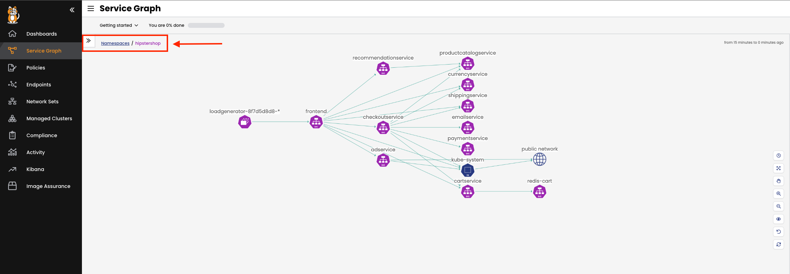

Welcome to Tigera's self-paced workshops. As part of this workshop, we will provide you with a Calico Cloud trial account! This account will automatically terminate after 24 hours.

- Run `invite` in the terminal to your left and when prompted, enter your email address.
- You will receive an invitation from the Calico Cloud environment via email. Accept the invitation by clicking the link included in the email.
- As soon as you sign in to Calico Cloud, we will set up your demo application environment.

**This installation process will take around 10 minutes**

Monitor the installation
==============

Use the terminal to check Calico Cloud’s installation status:

```
kubectl get installer default --namespace calico-cloud -o jsonpath --template '{.status}{"\n"}'
```

Once installation is complete, the status will change from **installing** to **done**.

Check Hipstershop in Calico Cloud
==============
In this cluster, we built a web-based e-commerce app where users can browse items, add them to the cart, and purchase them. This application is called Hipstershop.

- First, select the `default` cluster from the clusters menu in the top right corner.


- Go to the Service Graph in Calico Cloud and ensure that the Hipstershop application is running.
- To view resources in the `Hipstershop` namespace, click on the `Service Graph` icon on the left menu.
- Click on `Default` view for a top-level view of the cluster resources:


- Double-click on the `Hipstershop` namespace as highlighted.
- This will bring only resources in the `Hipstershop` namespace into view, along with other resources communicating into or out of the `Hipstershop` namespace.




Continue
==============
Once the installation is **done**, click **Next**.
