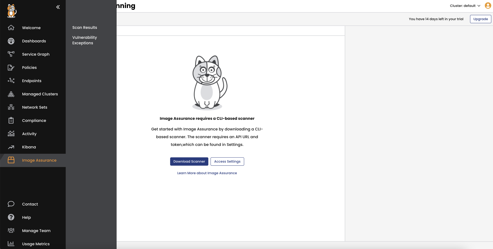
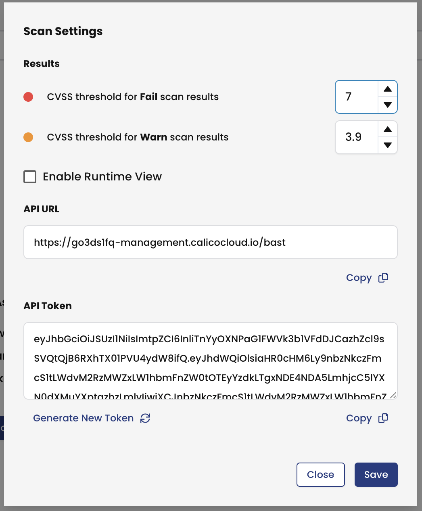
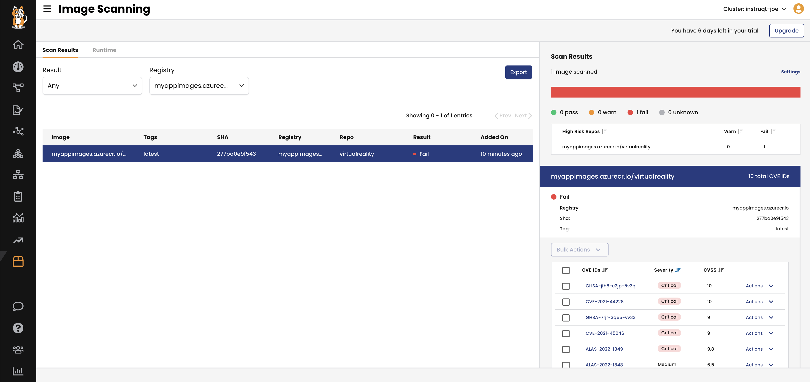

Image scanning
================
💡 Calico provides a command-line interface (CLI) to scan images, with the option to send results to the Manager UI.

NOTE: you can integrate the whole process with your CI/CD pipeline, but for this demonstration we will do it manually.


1- In order to report scan results to Calico Cloud, you need to get Calico Cloud’s API URL path and authorization token.
  - In Calico Cloud, go to **Image Assurance**, click **Scan results**, and click on **Access Settings**.




2- Check the new image locally.

```bash
docker images
```

3- Run Tigera’s scanner.

```bash
./tigera-scanner scan myappimages.azurecr.io/virtualreality:latest --apiurl https://<my-org>.calicocloud.io --token ezBhbGcetc...
```
4- View scan results in Calico Cloud. Click on **Image Assurance**, then click on **Scan results**



It's very obvious that the new image failed to pass the scan as it includes critical vulnerabilities. If you click the most critical vulnerability `CVE-2021-44228` to get more details, you will understand that this is the Log4j vulnerability.

👏 Good Job! You asked the application owner to fix these vulnerabilities before deploying it.

🏁 Finish
============
Click **Next** to continue to the next challenge.
