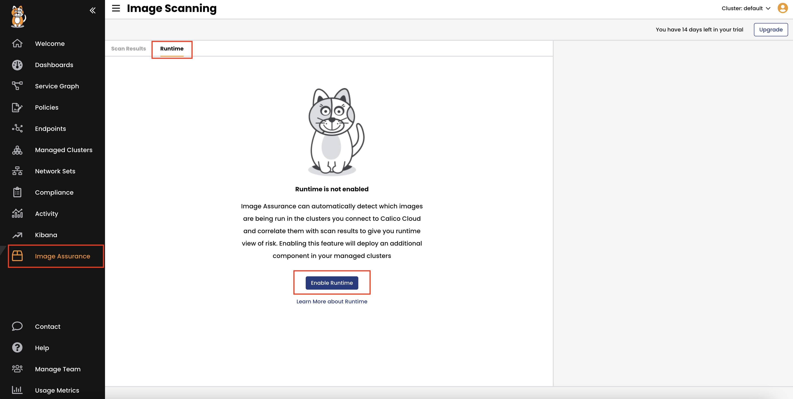
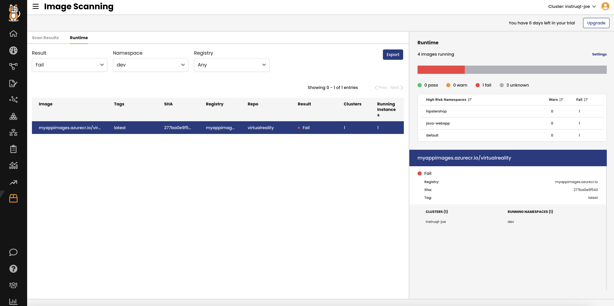

Set up vulnerability alerts
==================

**Goal**: Alert on a failed scan result within a pod in a namespace

In this example, an alert is created whenever there is at least one event for an image that has a scan result of Fail, that is running within a pod in any cluster in the `Hipstershop` namespace, within the past 30 minutes.

```bash
kubectl apply -f -<<EOF
apiVersion: projectcalico.org/v3
kind: GlobalAlert
metadata:
  name: example-3
spec:
  summary: "Vulnerabilities found in a pod"
  description: "Vulnerabilities found in a pod"
  severity: 100
  period: 10m
  dataSet: vulnerability
  query: result="Fail"
  metric: count
  condition: gt
  threshold: 1
EOF
```

Now that we have the alert ready let's enable runtime scanning to scan the running containers.

Continuous runtime scanning
==================

**Goal**:  Continuous runtime scanning for all running workloads.

1- From the Calico Cloud UI, click on **Image Assurance** > **Scan Results** > **Runtime** , then click **Enable Runtime**.



2- Once runtime scanning is enabled, click on **Namespaces**, and select **Hipstershop** to see if the current image of adservice is vulnerable to Log4j.



Scanning may take a few minutes; we will return to it later. In the meantime, let’s look at Image Assurance.

Image Assurance
=================

**Goal**: Automatic enforcement to block any vulnerable or non-scanned images from being deployed.

Container admission policies are custom Kubernetes resources that allow you to configure the criteria for the Admission Controller to reject admission requests for resources that create pods.

As a safety mechanism, you must specify the namespaces that the Admission Controller will apply to using a namespace selector.

1- Run the following command to check the configured namespace selector using Calico’s Admission Controller:

```bash
kubectl describe  ValidatingWebhookConfiguration image-assurance.tigera.io | grep -A 5 "Namespace Selector"
```

output should be:

```
  Namespace Selector:
    Match Expressions:
      Key:       apply-container-policies
      Operator:  In
      Values:
        true
```

2- Now add the same label to the application namespace to allow the Admission Controller to watch it.

```bash
kubectl label namespace hipstershop apply-container-policies=true
```

3- Stop for a minutes to read the security creteria in the following policy then apply it.

```bash
kubectl apply -f -<<EOF
apiVersion: containersecurity.tigera.io/v1beta1
kind: ContainerAdmissionPolicy
metadata:
  name: reject-failed
spec:
  selector: all()
  namespaceSelector: "apply-container-policies == 'true'"
  order: 1
  rules:
    - action: "Allow"
      imagePath:
        operator: IsOneOf
        values:
          - "^myappimages.azurecr.io/.*"
      imageScanStatus:
        operator: IsOneOf
        values:
          - "Pass"
          - "Warn"
      imageLastScan:
        operator: "gt"
        duration:
          days: 3
    - action: "Reject"
EOF
```

Here are the security criteria we used to allow images in the `Hipstershop` namespace:
1. Image should be from the registry `tigeralabs.azurecr.io`
2. Scan result should be `pass` or `warn`
3. Image's last scan should be within the last 3 days

If the image does not match these criteria, it will be blocked. Here is an example:

```bash
kubectl apply -f -<<EOF
apiVersion: apps/v1
kind: Deployment
metadata:
  name: virtualreality
  namespace: hipstershop
spec:
  selector:
    matchLabels:
      app: virtualreality
  template:
    metadata:
      labels:
        app: virtualreality
    spec:
      serviceAccountName: default
      terminationGracePeriodSeconds: 5
      containers:
      - name: server
        image: myappimages.azurecr.io/virtualreality:latest
EOF
```

You should get message similar to this:

```bash
Error from server (Action 'Reject' enforced by ContainerPolicy reject-failed rule index 1): error when creating "STDIN": admission webhook "image-assurance.tigera.io" denied the request: Action 'Reject' enforced by ContainerPolicy reject-failed rule index 1
```

🏁 Finish
============
Click **Next** to continue to the next challenge.