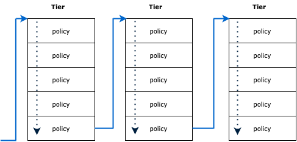
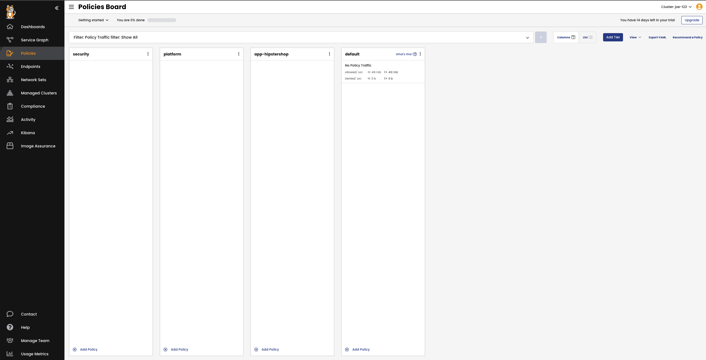
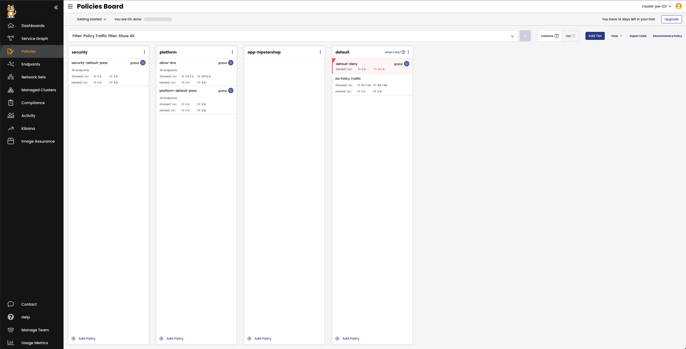
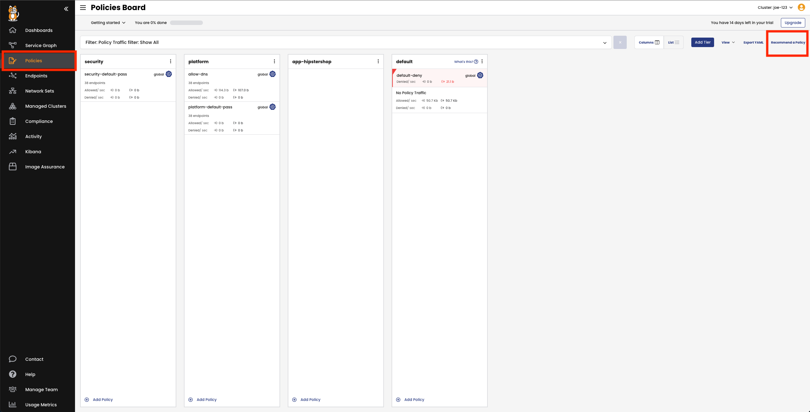
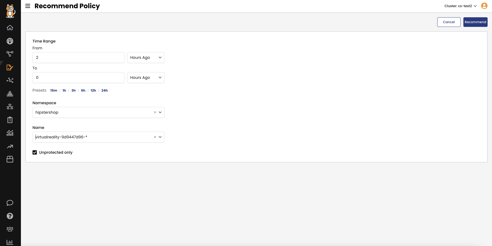

Labeling
================

-  In the Kubernetes world, labels are essential to identify workloads. Therefore, a good practice is to ensure that your application has a consistent labelling schema.
- In Hipstershop application, we have a label called "app" that defines the name of each microservice.
- check the labels using the following command and ensure that every pod has a label app assigned.

```bash
kubectl get pods -n hipstershop --show-labels
```

The output should be similar to the following:

```bash
tigera@bastion:~$ kubectl get pods -n hipstershop --show-labels
NAME                                     READY   STATUS    RESTARTS   AGE   LABELS
adservice-6569cd7bb6-v9v54               1/1     Running   0          28h   app=adservice,pci=true,pod-template-hash=6569cd7bb6
cartservice-f45c6bd9b-4h4pn              1/1     Running   22         28h   app=cartservice,pci=true,pod-template-hash=f45c6bd9b
checkoutservice-8596f74dc8-cj9vf         1/1     Running   0          28h   app=checkoutservice,pci=true,pod-template-hash=8596f74dc8
currencyservice-85599889d4-kspv5         1/1     Running   0          28h   app=currencyservice,pci=true,pod-template-hash=85599889d4
emailservice-78778f689b-dfljq            1/1     Running   0          28h   app=emailservice,pci=true,pod-template-hash=78778f689b
frontend-7cb647d79c-kz2gq                1/1     Running   0          28h   app=frontend,pci=true,pod-template-hash=7cb647d79c
loadgenerator-6cdf76b6d4-vscmj           1/1     Running   0          28h   app=loadgenerator,pci=true,pod-template-hash=6cdf76b6d4
multitool                                1/1     Running   0          28h   pci=true,run=multitool
paymentservice-868bc5ffcd-4k5sx          1/1     Running   0          28h   app=paymentservice,pci=true,pod-template-hash=868bc5ffcd
productcatalogservice-6948774f48-5xznt   1/1     Running   0          28h   app=productcatalogservice,pci=true,pod-template-hash=6948774f48
recommendationservice-cd689fc7d-h6w59    1/1     Running   0          28h   app=recommendationservice,pci=true,pod-template-hash=cd689fc7d
redis-cart-74594bd569-vg25j              1/1     Running   0          28h   app=redis-cart,pci=true,pod-template-hash=74594bd569
shippingservice-85c8d66568-jrdsf         1/1     Running   0          28h   app=shippingservice,pci=true,pod-template-hash=85c8d66568
```

Now that all pods are labeled, let’s start creating tiers.

Policy Tiers
================

💡 *Tiers* are a hierarchical construct used to group policies and enforce higher precedence policies that cannot be circumvented by other teams.

We begin by determining the priority of policies in tiers (from top to bottom). Each tier is ordered from left to right, starting with the tier with the highest priority. Policies are processed in sequential order, from top to bottom.

In the following example, the **platform** and **security** tiers use Calico's global network policies that apply to all pods, while developer teams can safely manage pods within namespaces for their applications and microservices using the "app-hipstershop" tier.



- For this workshop, create 3 tiers in the cluster while also using the default tier:

1. **Security** - Global security tier with controls such as PCI restrictions.

2. **Platform** - Platform-level controls such as DNS policy and tenant-level isolation.

3. **app-hipster** - Application-specific tier for microsegmentation inside the application.

- To create the tiers, apply the following manifest:

```yaml
kubectl apply -f -<<EOF
apiVersion: projectcalico.org/v3
kind: Tier
metadata:
  name: app-hipstershop
spec:
  order: 400
---
apiVersion: projectcalico.org/v3
kind: Tier
metadata:
  name: platform
spec:
  order: 300
---
apiVersion: projectcalico.org/v3
kind: Tier
metadata:
  name: security
spec:
  order: 200
EOF
```

- Now, navigate to Calico Cloud and check the created tiers under the **Policies** page.



Global Policies
================

💡*Global* Network policies is not a namespaced resource, it applies to the whole cluster.

After creating tiers, apply some general global policies before creating application-specific ones. These policies include allowing traffic to kube-dns from all pods, passing traffic that doesn't explicitly match in the tier and finally a default deny policy.

```bash
kubectl apply -f https://raw.githubusercontent.com/JosephYostos/Compliance-workshop/main/03-security-policies/mainfest/2.2-pass-dns-default-deny-policy.yaml
```

Now go to Calico Cloud and check the created policies under each tier



Policy Recommender
================

One of the global policies we created in the previous step is `default-deny`. Thus, we should explicitly define the allowed traffic. Otherwise, it will be blocked.

A good starting point is to ask Calico for some recommendation. Calico’s policy recommender inspects flows with an allow action between endpoints and generates a recommended policy accordingly, eliminating a lot of manual work.

- But before starting, let's test the connectivity between the `virtualreality` service and the `frontend` service

```bash
kubectl -n hipstershop exec -it $(kubectl -n hipstershop get po -l app=virtualreality -ojsonpath='{.items[0].metadata.name}') -- sh -c 'curl -m3 -sI frontend 2>/dev/null | grep -i http'
```
you will notice that the traffic is blocked because we don't have a policy in place to allow this trafic.

- Navigate to Calico Cloud and click on **Recommend a policy** under the **Policies Board** page.



- Set time range to **2H**, under namespace choose **hipstershop**, under name select the **virtualreality** service, and click Recommend



- Notice the policy created with the following settings:
Applies to workload with label app = virtualrealit.
Allow egress trafic over port 8080 to frontend service.
Allow egress DNS traffic over port 53 to kube-dns.
Implicity deny any other traffic.

- click **Enforce** to apply the policy

- As we now enabled the egress to frontend you need to create a policy to allow ingress traffic on the frontend side. let's do it.
- Set time range to **2H**, under namespace choose **hipstershop**, under name select the **frontend** service, and click Recommend
- Notice the policy created with the following settings:
Applies to workload with label app = frontend.
Allow ingress trafic over port 8080 from virtualreality service.
Allow egress traffic over port 80
Implicity deny any other traffic.
- click **Enforce** to apply the policy


- Now let's test the connectivity again, and this time the traffic should be allowed

```bash
kubectl -n hipstershop exec -it $(kubectl -n hipstershop get po -l app=virtualreality -ojsonpath='{.items[0].metadata.name}') -- sh -c 'curl -m3 -sI frontend 2>/dev/null | grep -i http'
```

🏁 Finish
============
Click **Next** to continue to the next challenge.