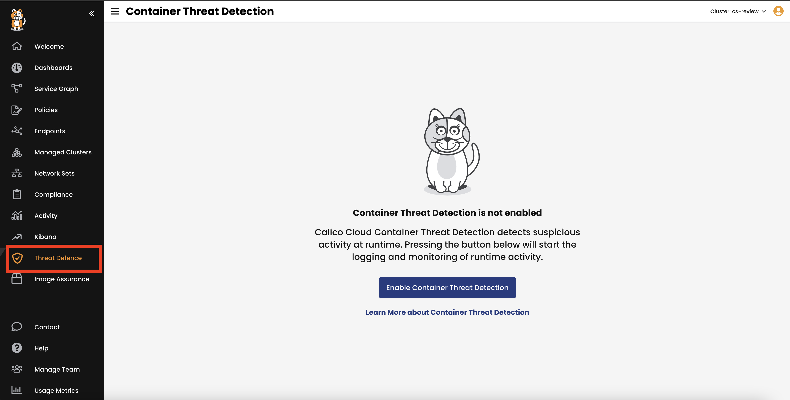
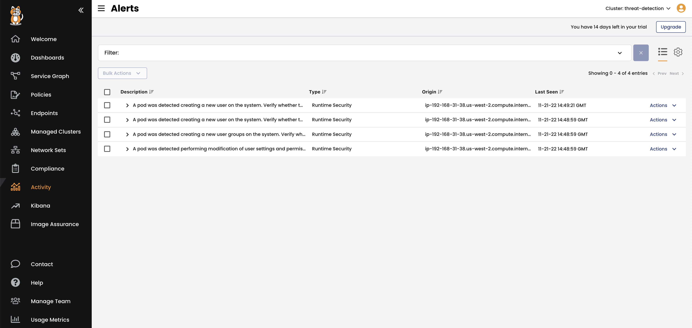

Calico Cloud provides a threat detection engine that analyzes observed file and process activity to detect known malicious and suspicious activity.

Enable container threat detection
================

Container threat detection is disabled by default. Let's enable it.

- To enable Container threat detection on your managed cluster, go to the **Threat Defence section** in the Calico Cloud UI, and select **Enable Container Threat Detection**.



- Change the default aggregation period

The default configuration of the runtime-reporter has an Aggregation period of 15 minutes [period: 15m].
In order to expedite testing we will reduce this to 15 seconds

```bash
kubectl -n calico-system get daemonset.apps/runtime-reporter -o yaml | sed 's/15m/15s/g' | kube^Cl apply -f -
```


Triggering malicious activity
================

Calico Cloud detects threats across the entire killchain. This example will focus on privilege-escalation tactics like Linux-Administrative-Command and Set-Linux-Capabilities, in addition to executing some attack tools as part of the execution stage.

Linux-Administrative-Command: A pod was detected executing Linux administrative commands using super-user privileges.
Set-Linux-Capabilities: A pod was detected executing commands on the system to modify a file, user, or group capabilities

- Let's start with deploying a testing pod.

```bash
kubectl run multitool --image=wbitt/network-multitool
```

- Now, it's time to execute suspicious processes and activity inside the container.

```bash
kubectl exec -it multitool -- bash
```

- Linux-Administrative-Command example

```bash
adduser joseph
su -
add user joseph
chown joseph file.txt
```

- Set-Linux-Capabilities example

```bash
touch file.txt
setcap cap_net_raw+ep file.txt
```

- Attack tools example

```bash
nmap -Pn -r -p 1-900 $POD_IP
```

- View alerts in Calico Cloud UI. From the left panel, click on **Activity**, then click on **Alerts**.



Quarantine suspicious workload
================

Once you get an alert and are sure this is not a legitimate activity, you may need to quarantine this pod using Calico security policy.

- A best practice is always to have a quarantine policy preconfigured in each cluster.

```bash
kubectl create -f - <<EOF
apiVersion: projectcalico.org/v3
kind: GlobalNetworkPolicy
metadata:
  name: security.quarantine
spec:
  tier: security
  order: 100
  selector: quarantine == "true"
  ingress:
    - action: Log
    - action: Deny
  egress:
    - action: Log
    - action: Deny
  types:
    - Ingress
    - Egress
EOF
```
- Now, you can quickly quarantine the malicious workload by adding the label "quarantine=true", here is an example:

```bash
kubectl label pod maliciouspod quarantine=true
```

🏁 Finish
============
Click **Finish** to complete the workshop.