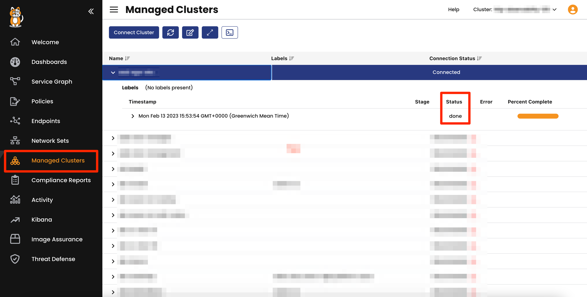
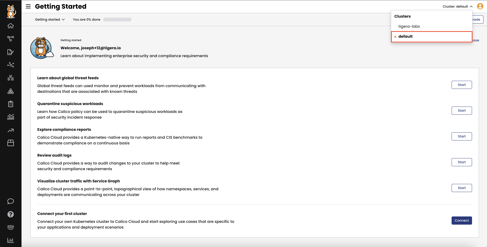

As a part of this workshop, we will provide you with a Calico Cloud trial account! The account will automatically terminate after 24 hours.

- Run `invite` in the terminal on your left and when prompted, enter your work email address (work email address is required).
- You will receive an invitation from Calico Cloud. Accept the invitation in the email.
- As soon as you sign in to Calico Cloud, we will set up your demo application environment.

**This installation process will take around 10 minutes**

Monitor the installation
==============

Use the terminal to check the Calico Cloud installation status:

```
kubectl get installer default --namespace calico-cloud -o jsonpath --template '{.status}{"\n"}'
```

Once the installation is complete, the status will change from **installing** to **done**

You can also check installation status from the Calico Cloud UI.
- Go to **Managed Clusters** in Calico Cloud and check the **Connection Status**



Once installation is complete, the status will change from **Installing** to **Connected**

Switch between clusters
==============

Calico Cloud is a multi-cluster solution where you can manage different clusters from a single window.
The cluster that we have just connected is called `default`

- Select the `default` cluster in the top right corner from the clusters menu.



Continue
==============
Once the installation is **Done**, click **Next**.
