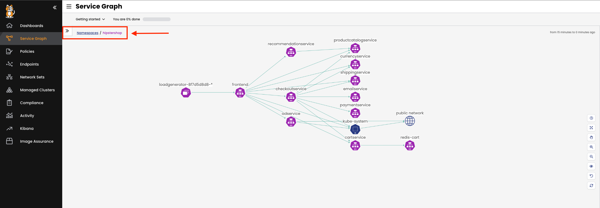

The Hipstershop tab
==============
In this cluster, there is a web-based e-commerce app where users can browse items, add them to the cart, and purchase them. This application is called "Hipstershop."
To make sure you can view the Hipstershop application, we have created a NodePort service for the frontend service. We also configured an embedded tab to point to the Hipstershop webpage.

- Click on the `Hipstershop` tab to make sure that the website is up and running.

The Hipstershop tab
==============

Let's start by ensuring that all pods are up and running in the `hipstershop` namespace with the following command:

```bash
kubectl get pods -n hipstershop
```

Check Hipstershop in Calico Cloud
==============
💡Calico’s Service Graph provides a point-to-point, topographical view of how namespaces, services, and deployments are communicating with each other in your cluster.

Note: As we have just deployed the application, it may take a few minutes to aggregate the flows and present the service graph.

- Go to the Service Graph in Calico Cloud and ensure that the Hipstershop application is running.
- To view resources in the `hipstershop` namespace, click on the `Service Graph` icon on the left menu.
- Click on `Default` view for a top-level view of the cluster resources:


- Double-click on the `Hipstershop` namespace as highlighted.
- This will bring only resources in the `hipstershop` namespace in view, along with other resources communicating into or out of the `hipstershop` namespace.




🏁 Finish
============
Click **Next** to continue to the next challenge.