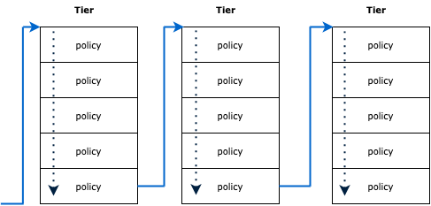

Check connectivity
================
Let's start by validating the problem.

- Click on the `Hipstershop` tab and see if you can access the web page of the Hipstershop frontend.

It looks like the website is not loading.

- Let's try to access the `frontend` service internally from the `loadgeneration` service

```bash
kubectl -n hipstershop exec -it $(kubectl -n hipstershop get po -l app=loadgenerator -ojsonpath='{.items[0].metadata.name}') -c main -- sh -c 'curl -m3 -I frontend.hipstershop'
```
You are getting a “connection timed out” message.

```
curl: (28) Connection timed out after 3000 milliseconds
```

- Run the following command to make sure that `frontend` is running and was never restarted:

```bash
kubectl get pods -n hipstershop -l app=frontend
```

Do you want to try it yourself?
================

Take some time and try to solve this issue by yourself before continuing.


The Calico dashboard
================

The Calico dashboard is a great way to monitor your environment. Calico provides two dashboards, a cluster-based dashboard and a namespace-based dashboard.
In our scenario, we can use the namespace-based dashboard as we’re looking at the `Hipstershop` namespace.

- To view more traffic in the dashboard, we can generate traffic from the `loadgenerator` pod to the `frontend` service using the following command:

```bash
for i in {1..10}; do kubectl -n hipstershop exec -it $(kubectl -n hipstershop get po -l app=loadgenerator -ojsonpath='{.items[0].metadata.name}') -c main -- sh -c 'curl -m3 -I frontend.hipstershop 2>/dev/null'; sleep 2; done
```

- From the Calico Cloud UI, click on **Dashboards** and select the `hipstershop` namespace.


- One of the views you’re looking at is the `Packets by Policy` histogram, where green bars represent allowed traffic and red represent denied traffic.
- As more traffic gets denied, you will begin seeing a red bar in the histogram. If you mouse over the red bar, you can find out the name of the policy blocking this traffic.


It looks like a network policy is blocking this traffic. Let's go over to the service graph to get more information.

Service graph
================

The Dynamic service and Threat Graph is the tool to spot any change in your workload behavior by visualizing traffic between your workloads.

Go to the Service Graph in Calico Cloud and ensure that the Hipstershop application is running.
- In the Calico Cloud UI, click on the `Service Graph` icon on the left menu.
- Select the `Default` view, then double-click the `hipstershop` namespace.
- You will notice that traffic to `frontend` service is represented in a red line. A red line means that this traffic is blocked.


- Now, if you click on this red line between the `loadgenerator` and `frontend` services, you can get all the denied flows.
- Expand one of these denied flows and try to understand which policy is blocking this traffic.

Calico provides traffic flows with Kubernetes context that are very efficient when it comes to troubleshooting.


- As shown in the screenshot, you can see the source and destination pod name and the policies evaluating this flow.
- In the policies row, you get the action taken by each policy, which is either allow, pass, or deny.
- It looks like this traffic denied by a policy called `app-hipstershop.frontend`

Let's review this policy and solve the issue.

Policies board
================
To start working with policies, click on `Policies` on the left menu.


Let's first understand the different elements of the policy board:
- This example has four tiers: security, platform, app-hipstershop, and default. “Tiers” are a hierarchical construct used to group policies.
- Under each tier, we create the policies, and you can use role-based access controls (RBAC) to tie each tier to a particular team.
- Traffic is evaluated from left to right across the tiers, and from top to bottom inside each tier.



Now, back to our problem.

- From the previous step, we know that the policy `app-hipstershop.frontend` (frontend is the policy name under the app-hipstershop tier) is denying the traffic.
- As previously mentioned, this policy is highlighted in red, which means it denies traffic.


- Double-click on the frontend policy.
- Our problem is that the incoming traffic to the frontend is blocked. Incoming traffic means `ingress`. Do you see any ingress rules defined?


- No ingress rules were defined. Samantha mentioned that everything was working fine before. So what changed?
- From the same place, check the history of any changes that happened to this policy. Scroll down to see the `change log`.


- It looks like the policy has been updated recently by user `Kubernetes-admin`. Click on the double arrow icon next to the updated change log to see what was changed.


- Here, we see that someone deleted the ingress rule. Let's try to create it again.
- Close the `diff` page, scroll up the policy page, and click `Edit policy`.
- Click `Add Ingress Rule`.


- Select `Allow`, `Protocol is TCP`, `Port is 8080`, and click `Save Rule`.


- Scroll up and click `Enforce` to activate the new rule.


- Now it's testing time. Click on `Hipstershop` to see if the website is back online.

**It’s back online! Great job!**


🏁 Finish
============
Click **Next** to continue to the next challenge.

