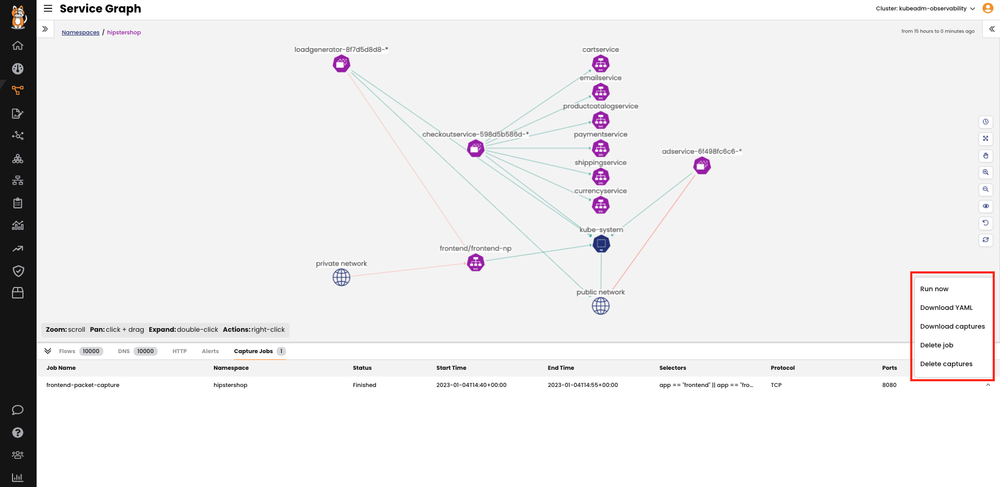

Dynamic Packet Capture
===============

With Dynamic Packet Capture in Dynamic Service and Threat Graph, all it takes is a single click to start a packet capture based on the user’s role assigned in the namespace.

- From the Calico Cloud UI, click on the `Service Graph`.
- Double-click the `hipstershop` namespace.
- Right-click the `frontend` service and select `initiate packet capture`.

- Give the packet capture job a name and select a time interval, port, and protocol. Then click `Run`.

- You can check the job status from the `Capture Jobs` tab in the bottom panel. Once it gets completed, you can:

Rerun/stop a capture job
Retrieve and delete capture files
View YAML files
Delete a capture job

Dynamic Packet Capture is easy and super fast. It also integrates with Kubernetes RBAC, which allows teams to troubleshoot workloads within their own namespaces without affecting the rest of the Kubernetes cluster. Additionally, within the same cluster or namespace, the RBAC integration helps differentiate between who can run the packet capture and who can retrieve the captured files.

🏁 Finish
=========
Click **Next** to continue to the next challenge.
