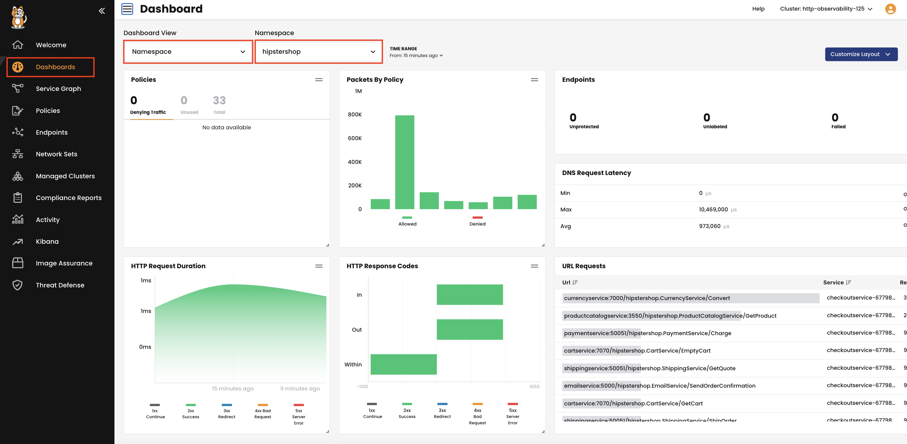

Calico Application Level Observability
===============

Calico provides visibility into L7 traffic without the need for a service mesh. Calico will give you a centralized, all-encompassing view of service-to-service traffic in the Kubernetes cluster. Have a single pane of glass of all the application-layer traffic, broken down by service, response code, performance metrics, API calls, and application-level log data matched to networking-level data by default.

L7 logs are also key for detecting anomalous behaviors like attempts to access applications, restricted URLs, and scans for particular URLs.

How does it work?
===============

- Calico deploys an Envoy proxy as a daemonset, then collects L7 logs by sending the selected traffic through an Envoy proxy.
- Application level observability is pre-enabled in this environment for the demo purpose. To learn how to enable it in your cluster, check our documentation.
- Verify that application layer log collection is enabled using the following command:
```bash
kubectl get ApplicationLayer -o yaml | grep collectLogs:
```
- Once we have the application layer log collection enabled, we select which service we wish to collect its logs by annotating the service.
- In this lab, we annotated all the Histershp services. Check it using the following command:
```bash
kubectl get svc -n hipstershop -o yaml| grep -Ev 'grpc|http' | grep -E 'name:|l7-logging'
```

```
projectcalico.org/l7-logging: "true"
name: adservice
projectcalico.org/l7-logging: "true"
name: cartservice
projectcalico.org/l7-logging: "true"
name: checkoutservice
projectcalico.org/l7-logging: "true"
name: currencyservice
projectcalico.org/l7-logging: "true"
name: emailservice
projectcalico.org/l7-logging: "true"
name: frontend
projectcalico.org/l7-logging: "true"
name: frontend-np
projectcalico.org/l7-logging: "true"
name: paymentservice
projectcalico.org/l7-logging: "true"
name: productcatalogservice
projectcalico.org/l7-logging: "true"
name: recommendationservice
projectcalico.org/l7-logging: "true"
name: redis-cart
projectcalico.org/l7-logging: "true"
name: shippingservice
```

Let's review and analyis the application layer logs for Hipstershop application.

Calico dashboard
===============
As we discussed in module three, Calico provides two dashboards, a cluster-based dashboard and a namespace-based dashboard.
In our scenario, we can use the namespace-based dashboard as we’re looking at the `Hipstershop` namespace.

- From the Calico Cloud UI, click on **Dashboards** and select the `hipstershop` namespace.



- From the dashboard we can get an overview of the following:

HTTP Request Duration: Changes in request duration may indicate a performance issue on the service.
HTTP Response Codes: Unusual HTTP response code numbers may indicate an error on the service or an attempt to exploit or enumerate web service behaviour.
URL Requests: This shows a list of URLs that the requests were made against, which is very helpful in spotting any communication to an unauthorized URL.

Service graph
===============
The dynamic service and threat graph shows more details of the application level logs.

- In the Calico Cloud UI, click on the `Service Graph` icon on the left menu.
- Select the `Default` view, then double-click the `hipstershop` namespace.
- In the bottom pane you will see L7 logs in the `HTTP` tab.


Expand any of the requests to get all the information you need to troubleshoot any HTTP performance bottlenecks.

Kibana dashboards and logs
===============
Kibana is the frontend for Calico Cloud Elasticsearch, which is the logging infrastructure that centrally stores logs from all managed clusters.

Calico provides HTTP dashboard in kibana that includes application performance metrics for inscope Kubernetes services.

To view the L7 HTTP dashboard:
1. In the Manager UI left navbar, click `Kibana`.
2. In the new Kibana browser, select `Dashboards` from the menu on the left.
3. choose the "L7 HTTP Dashboard"


You can display data within a specified time range. The default time range is 15 minutes, but you can customize it from the right corner.


Based on the HTTP request and response data, we can analyze the following:
- L7 HTTP requests
- L7 all services
- L7 HTTP duration
- L7 HTTP methods
- L7 HTTP response codes
- L7 HTTP request duration
- L7 HTTP requests over time
- L7 HTTP method by service
- L7 HTTP response by service
- L7 HTTP bytes transferred
- L7 Top URLs
- L7-search (raw HTTP logs)

Kibana is part of calico cloud, so you don't need to install extra components. The dashboard will help you to discover any abnormal behaviour faster and analyze performance bottlenecks of your application-level traffic.

🏁 Finish
=========
Click **Next** to complete the track.
